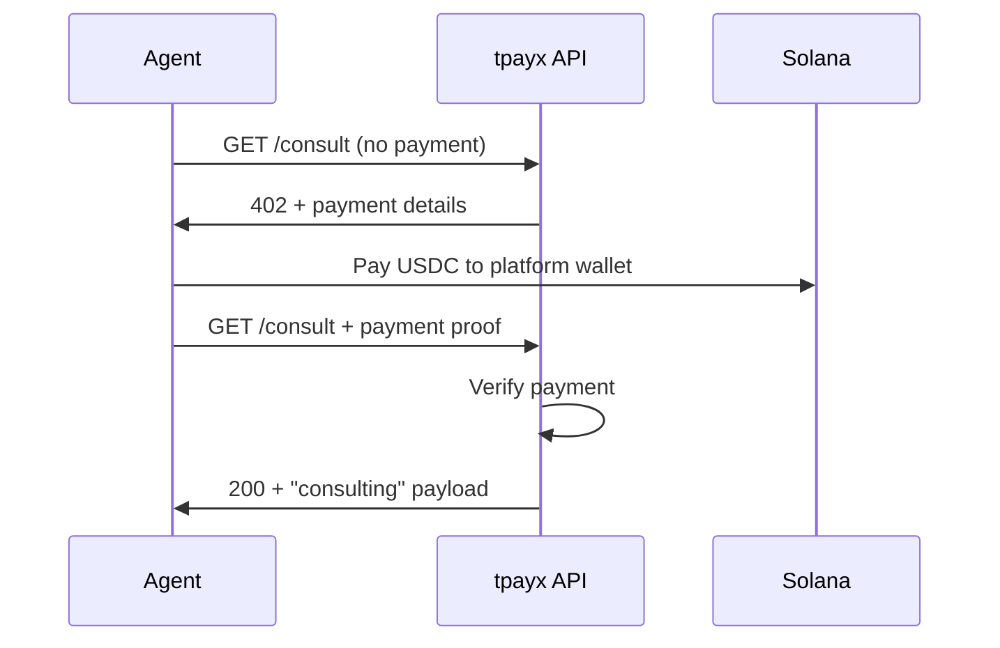

# x402 Support and Consultant Agent Plan

## Context

- **x402**: HTTP 402 "Payment Required" protocol for AI agent micropayments (stablecoins, no API keys, instant settlement). Implementations: [OpenLibx402](https://openlibx402.github.io/docs/) (FastAPI/Express/Next.js, Solana-first), and the [x402.org](https://www.x402.org/) standard.
- **Current tpayx**: Solana-only. Vaults and investing live on the [tigerpay](solana-programs/programs/tigerpay/src/instructions/invest.rs) program (invest instruction); [React frontend](frontend/src/pages/Vaults.tsx) uses mock data. Backend is a [skeleton](backend/package.json) (Prisma/tsx, empty `api/`, `services/`).
- **Investment flow**: On-chain invest is always signed by the investor (Solana keypair/agent wallet). So "agent invests" = agent has a keypair and signs the invest instruction; "user's wallet" implies delegation or user signing (e.g. via a relayer or approved agent key).

---

## 1. Agent-facing API and x402 surface

**Goal:** One backend that (a) serves vault data and investment metadata for agents, and (b) exposes x402-paid routes where it makes sense.

- **Backend choice:** Use the existing [backend](backend/) (Node/TypeScript). Add a small HTTP API (e.g. Express or Hono) so we can plug in [OpenLibx402 Express/Next.js](https://openlibx402.github.io/docs/packages/typescript/openlibx402-express/) or equivalent x402 middleware. Alternative: separate small Python/FastAPI service if you prefer OpenLibx402’s FastAPI story for demos.
- **Free agent endpoints (no x402):**
  - `GET /vaults` — list fundraising vaults (from chain indexer or DB; initially can proxy/aggregate from existing EVM/Solana reads or mock).
  - `GET /vaults/:id` — vault detail (params needed for building invest tx: vault address, chain, min/max amount, token, etc.).
  - Optional: `POST /vaults/:id/invest/prepare` — returns unsigned tx (or tx params) for a given vault + amount + chain so the agent (or user wallet) can sign and submit. No payment; this is “support for agents to invest” by giving them everything they need to sign themselves.

**x402-paid endpoints (for funding narrative and consultant):**

- **Premium data (optional):** e.g. `GET /vaults/analytics` or per-vault “insights” behind x402 (small amount, e.g. $0.01–0.10 per request). Good for “agents pay for value” slide.
- **Consultant agent (see below):** All consultant routes behind x402.

**Wallet model for “agent’s wallet vs user’s wallet”:**

- **Agent’s wallet:** Agent holds keypair (or HSM/env), calls `/vaults` and `/vaults/:id` (and optionally `/invest/prepare`), builds invest tx, signs with its key, submits to chain. No backend custody.
- **User’s wallet:** For “invest on behalf of user,” you need a safe delegation model (e.g. user signs a session key or meta-tx that allows a relayer to submit invest). Out of scope for v1; we can document as “future: delegated investing” and keep v1 as “agent’s own wallet” and “user signs in UI” only.

**Concrete steps:**

- Implement backend API (Express/Hono) with routes above and chain reads (or stub with mock vault list).
- Add OpenLibx402 middleware (or equivalent) and config (payment address, token mint, network). Protect only the routes you want paid (consultant + optional premium).
- Document for agents: base URL, 402 behavior, and how to use `/vaults` + `/vaults/:id` (+ optional `/invest/prepare`) to invest with their wallet.

---

## 2. Consultant agent (“insider” consulting)

**Goal:** A fun, clearly satirical API that other agents can “pay for consulting” via x402 and receive templated “insider” style responses about merchant vaults—positioned as a lighthearted way to monetize agent traffic.

**Design:**

- **Route(s):** e.g. `GET /consult` or `POST /consult` (with optional body: `{ "vaultId": "...", "question": "..." }`). Protected with x402 (e.g. $0.05–0.10 USDC per call).
- **Response:** Deterministic or templated “consulting” content:
  - Short vault summary (from public vault data).
  - Clearly humorous “insider” lines (e.g. “*This is not financial advice. Our consultants are not real.*” or “*Confidential: this vault may or may not be good.*”).
  - Optional: 1–2 “negotiation tips” that are obviously parody (e.g. “Try asking the smart contract nicely”).
- **Legal/positioning:** Keep it obvious parody; add disclaimer in response and in docs so it’s not mistaken for real advice.

**Implementation:**

- Add consultant route(s) on the same backend.
- Apply x402 middleware to consultant routes only; free `/vaults` stays free.
- Implement response builder (templates + public vault fields). No real insider data; all content derived from public info or fixed jokes.

**Flow (mermaid):**

---

## 3. Frontend and chain integration (minimal for x402)

- **Frontend:** No strict requirement for x402 on the web app; humans keep using “Connect wallet” and sign invest in the existing flow. Optional: add a small “For AI agents” section or doc link that points to the agent API and x402 behavior.
- **Chain:** No program changes needed for x402 or consultant. Investment remains as today: investor signs the Solana `invest` instruction. Backend only reads chain (and optionally prepares unsigned tx for agents).

---

## 4. Suggested implementation order

| Step | What                                                                                                   |
| ---- | ------------------------------------------------------------------------------------------------------ |
| 1    | Backend: HTTP server + `GET /vaults` and `GET /vaults/:id` (mock or chain-backed).                     |
| 2    | Backend: Integrate x402 middleware (OpenLibx402 or similar); config (wallet, token, network).          |
| 3    | Backend: Consultant route(s) behind x402; template responses + disclaimer.                             |
| 4    | Optional: `POST /vaults/:id/invest/prepare` for agent-signed invest; document agent flow.              |
| 5    | Optional: One premium x402-paid endpoint (e.g. vault analytics) for funding narrative.                 |
| 6    | Docs: “AI agents” page or README section (base URL, 402, consultant, how to invest with agent wallet). |

---

## 5. Risks and mitigations

- **Legal:** Consultant is parody; keep disclaimers in API response and docs; avoid any real “insider” claims.  
- **x402 stack:** OpenLibx402 is still evolving (multi-chain planned); start with one chain (e.g. Solana devnet) and one token (e.g. USDC) for the consultant.  
- **“User’s wallet”:** Defer to post-MVP; document as future work to avoid scope creep.

---

## 6. Outcome for funding talks

- **x402:** “We support AI-native payments (x402); agents can discover vaults and invest with their own wallet; we’re payment-rail ready.”  
- **Consultant:** “We also run a paid consultant API that agents can call—shows demand for agent-to-agent paid services and our sense of humor.”

If you want, next step can be a concrete task list (file-level) for the backend and consultant (e.g. `backend/src/api/vaults.ts`, `backend/src/api/consult.ts`, and x402 middleware wiring).

---

## 7. Future: Trained Chatbot Agent (OpenRouter)

One agent for (a) human-facing chatbot (support, onboarding, vault Q&A) and (b) the x402 consultant. Use **[OpenRouter](https://openrouter.ai)** for inference so you get stronger models (GPT-4, Claude, Llama 70B, etc.) without local hosting. RAG + system prompts + few-shot define behavior; no GPU required. Optional later: local fallback or LoRA fine-tuning. Full details (model picks, training approach, cost/hardware): [docs/future-trained-chatbot-agent.md](docs/future-trained-chatbot-agent.md).