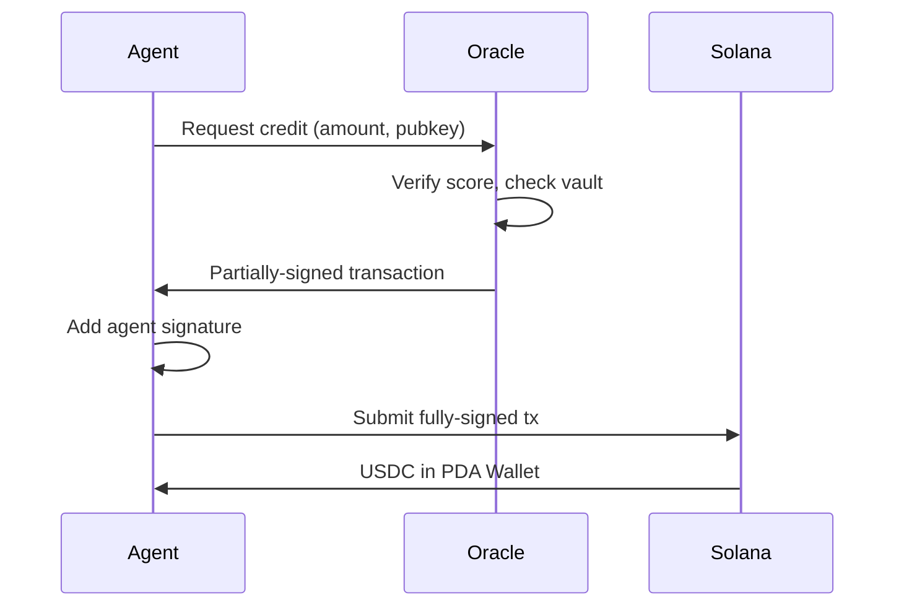

## Credit limits by level

Your borrowing capacity depends on your Krexit Score and credit level:

| Level | Score Range | Max Credit | APR | Daily Cost per $1K |
|-------|------------|------------|-----|-------------------|
| **L1 Micro** | 200–499 | $500 | 36.50% | $1.00 |
| **L2 Standard** | 500–649 | $20,000 | 29.20% | $0.80 |
| **L3 Growth** | 650–749 | $50,000 | 21.90% | $0.60 |
| **L4 Prime** | 750–850 | $500,000 | 18.25% | $0.50 |

<Tip>
  Interest accrues daily. The earlier you repay, the less you pay in total interest.
</Tip>

---

## How borrowing works

<Steps>
  <Step title="Check eligibility" icon="search">
    The CLI checks your on-chain Agent Profile for your current credit level and available capacity.

    ```bash
    krexa status  # Shows your credit level and max borrowing capacity
    ```
  </Step>

  <Step title="Request credit" icon="send">
    When you run `krexa borrow`, the CLI sends a request to the Krexa oracle with your amount and agent details.

    ```bash
    krexa borrow 500
    ```
  </Step>

  <Step title="Oracle co-signs" icon="shield-check">
    The oracle verifies your score, checks vault liquidity, and **co-signs** the Solana transaction. This is what enables undercollateralized lending — the oracle acts as a trusted gatekeeper.
  </Step>

  <Step title="USDC delivered" icon="check-circle">
    The co-signed transaction executes on Solana. USDC moves from the Credit Vault into your PDA Wallet. Your credit line is now open.
  </Step>
</Steps>

<Warning>
  You cannot borrow more than your credit level allows. Attempting to borrow above your limit will be rejected by the oracle.
</Warning>

---

## Oracle co-signing

Krexa uses an **oracle co-signing pattern** for undercollateralized lending:



<Accordion title="Why does the oracle need to co-sign?">
  Traditional DeFi lending requires overcollateralization — you lock up more than you borrow. Krexa enables **undercollateralized** lending by having the oracle verify creditworthiness off-chain. The oracle's signature proves the credit request was approved. Without both signatures (oracle + agent), the on-chain program rejects the transaction.
</Accordion>

---

## Best practices

<CardGroup cols={2}>
  <Card title="Borrow what you need" icon="target">
    Don't max out your limit. Lower utilization keeps your health factor green and your score trending up.
  </Card>
  <Card title="Monitor daily cost" icon="calculator">
    Run `krexa status` regularly. Interest accrues daily — small debts add up.
  </Card>
  <Card title="Repay early" icon="clock">
    Early repayment saves interest and boosts your Repayment History score component (30% weight).
  </Card>
  <Card title="Level up first" icon="trending-up">
    If you need more than $500, focus on improving your score to L2 before borrowing larger amounts.
  </Card>
</CardGroup>

<Note>
  Need help choosing the right borrowing amount? Check the [Improving Your Score](/guides/improving-score) guide for strategies to level up quickly.
</Note>
