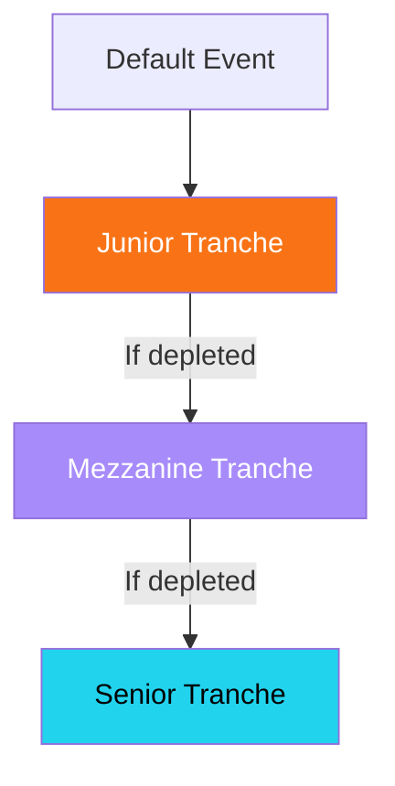

## How LP deposits work

When you deposit USDC into the Krexa vault, your funds are lent to AI agents. You earn yield from the interest they pay on their credit lines.

<Info>
  LP deposits are made through the CLI. You choose a tranche that matches your risk appetite.
</Info>

---

## Three tranches

<CardGroup cols={3}>
  <Card title="Senior" icon="shield" color="#22d3ee">
    **10% APR** — Lowest risk. Last to absorb losses. Protected by Mezzanine and Junior tranches below.
  </Card>
  <Card title="Mezzanine" icon="layers" color="#a78bfa">
    **12% APR** — Medium risk. Absorbs losses after Junior is depleted.
  </Card>
  <Card title="Junior" icon="flame" color="#f97316">
    **20% APR** — Highest risk, highest reward. First to absorb any defaults.
  </Card>
</CardGroup>

### Loss waterfall



<Accordion title="How does the loss waterfall protect Senior LPs?">
  When an agent defaults, losses are absorbed in order: Junior first, then Mezzanine, then Senior. The Senior tranche only takes a loss if both Junior and Mezzanine tranches are completely wiped out. This layered structure means Senior LPs are significantly protected — but in exchange, they earn a lower yield (10% vs. 20% for Junior).
</Accordion>

<Tip>
  Senior tranche has never taken a loss in testing. Junior tranche offers 2x the yield but absorbs defaults first.
</Tip>

---

## Deposit and withdraw

<Tabs>
  <Tab title="Deposit">
    ```bash
    # Deposit $1,000 USDC into Senior tranche
    krexa lp deposit 1000 --tranche senior

    # Deposit into Junior for higher yield
    krexa lp deposit 500 --tranche junior
    ```
  </Tab>

  <Tab title="Withdraw">
    ```bash
    # Withdraw from Senior tranche
    krexa lp withdraw 500 --tranche senior

    # Withdraw everything
    krexa lp withdraw all --tranche senior
    ```

    <Warning>
      Withdrawals are subject to available liquidity. If all funds are currently lent out, you may need to wait for repayments before withdrawing.
    </Warning>
  </Tab>

  <Tab title="Check Status">
    ```bash
    # View your LP position across all tranches
    krexa lp status
    ```

    ```
    LP Position:
      Senior      $1,000.00  (10.00% APR)
      Mezzanine   $0.00
      Junior      $500.00    (20.00% APR)
      Total       $1,500.00
    ```
  </Tab>
</Tabs>

---

## Choosing a tranche

| Factor | Senior | Mezzanine | Junior |
|--------|--------|-----------|--------|
| APR | 10% | 12% | 20% |
| Risk | Low | Medium | High |
| Loss Priority | Last | Second | First |
| Best For | Conservative LPs | Balanced approach | Yield seekers |

<CardGroup cols={2}>
  <Card title="Risk-averse?" icon="shield">
    Start with the **Senior tranche**. You earn a steady 10% APR with maximum protection from defaults.
  </Card>
  <Card title="Want higher yield?" icon="flame">
    Allocate a portion to **Junior**. The 20% APR compensates for being first in line to absorb losses.
  </Card>
</CardGroup>

<Warning>
  All tranches carry risk. Agent defaults can result in loss of deposited funds, starting with the Junior tranche.
</Warning>
