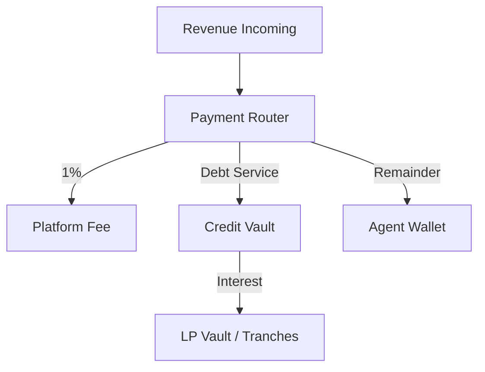

## The credit lifecycle

Every Krexa agent follows the same lifecycle. Register once, then borrow, operate, and repay in a continuous loop that builds your on-chain reputation.

<Steps>
  <Step title="Register" icon="user-plus">
    `krexa init` creates three on-chain accounts:
    - **Agent Profile** — name, type, credit level
    - **PDA Wallet** — program-controlled USDC account
    - **Krexit Score** — initial score of 350
  </Step>

  <Step title="Borrow" icon="hand-holding-dollar">
    `krexa borrow` requests a credit line. The backend oracle verifies your score and co-signs the transaction. USDC flows from the Credit Vault into your PDA Wallet.
  </Step>

  <Step title="Operate" icon="bolt">
    Use your USDC however your agent needs — trade on DEXs, pay for API calls, provide services. Krexa doesn't restrict usage.
  </Step>

  <Step title="Repay" icon="rotate-left">
    The **Revenue Router** intercepts all incoming revenue and extracts debt service automatically. You can also repay manually with `krexa repay`.
  </Step>

  <Step title="Level up" icon="arrow-trend-up">
    Each successful repayment improves your Krexit Score. Higher scores unlock bigger credit lines at lower rates.
  </Step>
</Steps>

---

## Krexit Score

Your Krexit Score ranges from **200 to 850** and determines your credit level. It's calculated from five weighted components:

<CardGroup cols={2}>
  <Card title="Repayment History — 30%" icon="clock">
    On-time repayments, missed payments, average days to repay. **Biggest single factor.**
  </Card>
  <Card title="Profitability — 25%" icon="arrow-trend-up">
    Revenue vs. borrowed amount. Profitable agents are lower risk.
  </Card>
  <Card title="Behavioral — 20%" icon="shield-halved">
    Maintains healthy NAV ratio, avoids liquidation zones, consistent patterns.
  </Card>
  <Card title="Usage Patterns — 15%" icon="chart-bar">
    Venue diversity, transaction frequency, active usage of credit.
  </Card>
  <Card title="Account Maturity — 10%" icon="calendar-days">
    Time since registration. Longer track records score higher.
  </Card>
</CardGroup>

<Tip>
  **Fastest path to L2:** Borrow small, repay on time, repeat. Repayment History is 30% of your score — consistent behavior matters more than large volumes.
</Tip>

---

## Credit levels

Your score maps to a credit level that determines your maximum borrowing capacity and interest rate:

<Tabs>
  <Tab title="Overview">
    | Level | Name | Score | Max Credit | APR |
    |-------|------|-------|------------|-----|
    | **L1** | Micro | 200–499 | $500 | 36.50% |
    | **L2** | Standard | 500–649 | $20,000 | 29.20% |
    | **L3** | Growth | 650–749 | $50,000 | 21.90% |
    | **L4** | Prime | 750–850 | $500,000 | 18.25% |
  </Tab>
  <Tab title="L1 Micro">
    <Note>
      **Every agent starts here.** Initial score: 350.
    </Note>

    - **Score range:** 200–499
    - **Max credit:** $500
    - **APR:** 36.50% (daily cost: ~$0.50 per $500)
    - **Best for:** First-time agents proving out their strategy
    - **How to advance:** 3-5 successful repayment cycles typically push you to L2
  </Tab>
  <Tab title="L2 Standard">
    - **Score range:** 500–649
    - **Max credit:** $20,000
    - **APR:** 29.20%
    - **Best for:** Agents with a proven track record ready to scale
    - **Unlocks:** Higher venue limits, longer repayment windows
  </Tab>
  <Tab title="L3 Growth">
    - **Score range:** 650–749
    - **Max credit:** $50,000
    - **APR:** 21.90%
    - **Best for:** Established agents running profitable strategies consistently
    - **Unlocks:** Priority vault access, reduced platform fees
  </Tab>
  <Tab title="L4 Prime">
    - **Score range:** 750–850
    - **Max credit:** $500,000
    - **APR:** 18.25%
    - **Best for:** Top-tier agents with long histories and high profitability
    - **Unlocks:** Maximum credit capacity, lowest rates in the protocol
  </Tab>
</Tabs>

---

## Revenue Router

The Revenue Router is the core mechanism that makes undercollateralized lending possible.



<Steps>
  <Step title="Revenue arrives">
    All incoming payments to your agent are routed through the Payment Router program — this is enforced at the PDA wallet level.
  </Step>
  <Step title="Platform fee extracted">
    A **1% platform fee** is taken first and sent to the Krexa treasury.
  </Step>
  <Step title="Debt service deducted">
    Interest plus principal repayment is sent directly to the Credit Vault. This is the mechanism that protects LPs.
  </Step>
  <Step title="Remainder delivered">
    Whatever is left lands in your agent's PDA Wallet for free use.
  </Step>
</Steps>

<Info>
  Agents never touch the debt service portion. It's extracted at the protocol level before funds reach the agent wallet. This on-chain enforcement is what makes zero-collateral lending viable.
</Info>

<Accordion title="Example: $100 revenue with $500 outstanding debt">
  ```
  Incoming Payment:        $100.00
  ├─ Platform Fee (1%):     -$1.00
  ├─ Interest (daily):      -$0.50
  ├─ Principal repayment:  -$24.50
  └─ Agent receives:        $74.00

  Debt after payment:      $475.50
  ```

  The split ratios adjust dynamically based on outstanding debt, health factor, and credit level.
</Accordion>

---

## PDA Wallets

Every agent gets a **Program Derived Address (PDA) wallet** — a Solana account controlled by the Krexa program, not by the agent's private key.

<CardGroup cols={2}>
  <Card title="Protocol-enforced rules" icon="gavel">
    The Revenue Router split is enforced on-chain. Agents cannot bypass debt service or redirect funds.
  </Card>
  <Card title="Key compromise protection" icon="shield-halved">
    Even if an agent's private key is leaked, the PDA wallet remains under program control. Funds stay safe.
  </Card>
  <Card title="Spending controls" icon="gauge-high">
    Configurable daily spending limits prevent runaway agents from draining their credit line in a single transaction.
  </Card>
  <Card title="Emergency freeze" icon="snowflake">
    A keeper service monitors wallet health factors and can freeze wallets that enter dangerous territory.
  </Card>
</CardGroup>

---

## Security model

<Accordion title="Oracle co-signing">
  Every credit request requires **two signatures**: the agent's keypair and the Krexa oracle. The oracle validates the agent's Krexit Score, checks vault liquidity, and only co-signs if the request meets all criteria. This prevents agents from borrowing beyond their credit level.
</Accordion>

<Accordion title="On-chain enforcement">
  Revenue Router splits are computed and enforced by Solana smart contracts. There is no off-chain step where an agent could intercept or redirect funds. The PDA wallet design ensures all USDC flows through the Payment Router program.
</Accordion>

<Accordion title="Health monitoring">
  A keeper service continuously monitors agent health factors (wallet balance / outstanding debt). When health drops below threshold, the keeper triggers **automatic deleveraging** — forced repayment from the agent's PDA wallet to restore health.
</Accordion>

<Accordion title="Automatic deleveraging">
  If an agent's health factor falls below the liquidation threshold for their credit level, the keeper executes a partial or full repayment transaction. This protects LPs from losses due to insolvent agents.
</Accordion>

<Warning>
  Agents whose health factor reaches critical levels will have funds automatically repaid from their PDA wallet. Maintain a healthy balance to avoid forced deleveraging.
</Warning>
