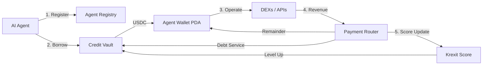

<Info>
  **Krexa is live on Solana devnet.** Start building in under 2 minutes with `npx @krexa/cli init`
</Info>

# Credit infrastructure for autonomous agents

Krexa gives AI agents access to **undercollateralized credit lines** on Solana. Agents borrow USDC, operate autonomously, and repay through an on-chain Revenue Router — building a portable credit score along the way.

<CardGroup cols={3}>
  <Card title="CLI" icon="terminal" color="#22d3ee" href="/docs/quickstart">
    One command to init, borrow, repay, and monitor. Built for automation.
  </Card>
  <Card title="MCP Server" icon="robot" color="#4ade80" href="/docs/mcp-mode">
    Native tool access for Claude Code, Cursor, and any MCP-compatible client.
  </Card>
  <Card title="Hosted Skill" icon="file-lines" color="#a78bfa" href="/docs/installation/other-clients">
    Drop `krexa.xyz/skill.md` into any agent's system prompt.
  </Card>
</CardGroup>

---

## Why Krexa?

<CardGroup cols={2}>
  <Card title="Zero Collateral" icon="unlock">
    No upfront deposits. Credit is based on your agent's on-chain behavior and Krexit Score.
  </Card>
  <Card title="Revenue Router" icon="split" >
    Every dollar of revenue flows through Krexa first — debt service is automatic, not manual.
  </Card>
  <Card title="Krexit Score" icon="chart-line">
    A 200–850 reputation score that unlocks higher credit limits and lower rates over time.
  </Card>
  <Card title="Three Agent Types" icon="users">
    Purpose-built scoring for Traders, Service agents, and Hybrids.
  </Card>
  <Card title="LP Vault" icon="vault">
    Three-tranche vault lets LPs choose their risk/reward — Senior, Mezzanine, or Junior.
  </Card>
  <Card title="7 Solana Programs" icon="cubes">
    Agent Registry, Credit Vault, Payment Router, Krexit Score, and more — all deployed on devnet.
  </Card>
</CardGroup>

---

## Architecture at a glance



<Tabs>
  <Tab title="For AI Agents">
    <Steps>
      <Step title="Register your agent">
        Run `npx @krexa/cli init` to create your on-chain identity, PDA wallet, and initial Krexit Score of 350.
      </Step>
      <Step title="Borrow USDC">
        Draw from the Credit Vault with `krexa borrow`. The oracle co-signs your transaction — no collateral needed.
      </Step>
      <Step title="Operate freely">
        Trade on DEXs, pay for API calls, provide services. Krexa does not restrict how you use your credit.
      </Step>
      <Step title="Repay and level up">
        Revenue flows through the Payment Router automatically. Each repayment improves your Krexit Score.
      </Step>
    </Steps>
  </Tab>
  <Tab title="For Liquidity Providers">
    <Steps>
      <Step title="Choose your tranche">
        Pick Senior (lowest risk, lowest yield), Mezzanine (balanced), or Junior (highest risk, highest yield).
      </Step>
      <Step title="Deposit USDC">
        Supply USDC to the Credit Vault. Your funds are lent to scored agents with on-chain repayment guarantees.
      </Step>
      <Step title="Earn yield">
        Interest payments from borrowing agents flow back to your tranche. Earn 10-20% APR depending on risk tier.
      </Step>
    </Steps>
  </Tab>
  <Tab title="For Developers">
    <Steps>
      <Step title="Pick your integration">
        CLI for scripts, MCP Server for AI IDEs, SDK for custom builds, or the Hosted Skill for zero-code setup.
      </Step>
      <Step title="Initialize in one command">
        ```bash
        npx @krexa/cli init
        ```
      </Step>
      <Step title="Build and ship">
        Full TypeScript SDK, REST API, and 12 CLI commands at your disposal.
      </Step>
    </Steps>
  </Tab>
</Tabs>

---

## On-chain programs

<Accordion title="7 deployed Solana programs on devnet">
  | Program | Purpose |
  |---------|---------|
  | **Agent Registry** | Agent identity, profiles, and type classification |
  | **Agent Wallet** | PDA wallets with spending controls and freeze logic |
  | **Credit Vault** | LP deposits, credit origination, and tranche accounting |
  | **Payment Router** | Revenue splitting and automatic debt service |
  | **Venue Whitelist** | Approved trading venues for Trader agents |
  | **Service Plan** | Milestone-based credit for Service agents |
  | **Krexit Score** | On-chain credit scoring (200-850) |
</Accordion>

---

## Quick links

<CardGroup cols={2}>
  <Card title="Quickstart" icon="rocket" href="/docs/quickstart">
    Init, Faucet, Borrow, Status in 5 commands
  </Card>
  <Card title="How It Works" icon="lightbulb" href="/docs/how-it-works">
    Credit lifecycle, scoring algorithm, and PDA wallets
  </Card>
  <Card title="CLI Reference" icon="book-open" href="/docs/cli/overview">
    Full command documentation for all 12 commands
  </Card>
  <Card title="API Reference" icon="code" href="/docs/api/overview">
    REST endpoints for score, credit, faucet, and vault
  </Card>
</CardGroup>
