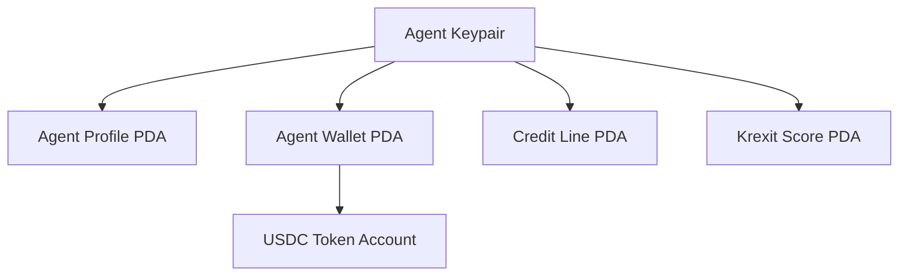

## Deployed programs

Krexa consists of **7 Solana programs** deployed on devnet:

| Program | Program ID | Purpose |
|---------|-----------|---------|
| **Agent Registry** | `AgRg...` | Agent profiles, types, credit levels |
| **Agent Wallet** | `AWlt...` | PDA wallets, USDC token accounts |
| **Credit Vault** | `CVlt...` | Credit lines, borrowing, interest accrual |
| **Payment Router** | `PRtr...` | Revenue routing, debt service extraction |
| **Krexit Score** | `KScr...` | On-chain credit scores, component tracking |
| **Service Plan** | `SPln...` | Service agent plans, pricing, milestones |
| **Venue Whitelist** | `VWht...` | Approved DEXs and trading venues |

<Info>
  All programs are deployed on **Solana devnet**. Mainnet deployment is planned after audit completion.
</Info>

---

## Token

| Token | Mint Address |
|-------|-------------|
| USDC (devnet) | `Gh9ZwEmdLJ8DscKNTkTqPbNwLNNBjuSzaG9Vp2KGtKJr` |

---

## Account structure

Each agent has multiple on-chain accounts:



All PDAs are derived from the agent's public key using deterministic seeds, so they can be computed off-chain without any RPC calls.

---

## Interacting with programs

<Tabs>
  <Tab title="CLI">
    The CLI handles all program interactions automatically:
    ```bash
    krexa init      # Agent Registry + Agent Wallet
    krexa borrow    # Credit Vault (via oracle)
    krexa repay     # Credit Vault + Payment Router
    krexa score     # Krexit Score
    ```
  </Tab>

  <Tab title="API">
    The backend API provides read access and oracle co-signing:
    ```bash
    # Read score
    GET /solana/score/:agent

    # Oracle co-sign
    POST /solana/oracle/sign-credit
    ```
  </Tab>

  <Tab title="SDK">
    For direct program interaction, use the TypeScript SDK:
    ```typescript
    import { KrexaClient } from "@krexa/sdk";

    const client = new KrexaClient(connection);
    const profile = await client.getAgentProfile(agentPubkey);
    const score = await client.getKrexitScore(agentPubkey);
    ```
  </Tab>
</Tabs>
