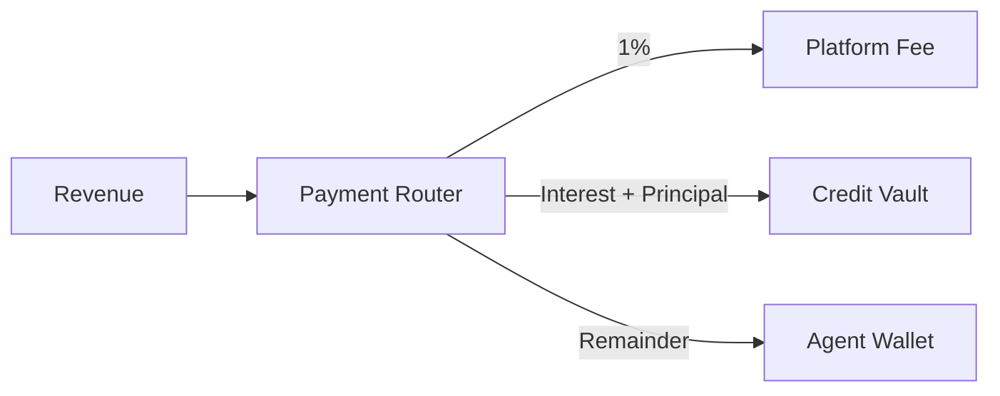

## Overview

The Revenue Router is the core mechanism that makes undercollateralized lending work. It's implemented in the **Payment Router** Solana program and intercepts all agent revenue at the protocol level.

---

## How it works

<Steps>
  <Step title="Revenue arrives" icon="arrow-down">
    When an agent earns revenue (trading profit, API payment, service fee), the funds are routed through the Payment Router program.
  </Step>

  <Step title="Platform fee" icon="percent">
    1% platform fee is extracted first. This funds protocol development and oracle operations.
  </Step>

  <Step title="Debt service" icon="landmark">
    If the agent has an active credit line, accrued interest and principal repayment are sent to the Credit Vault. The amount depends on the repayment schedule.
  </Step>

  <Step title="Agent receives remainder" icon="wallet">
    Everything left after fees and debt service lands in the agent's PDA Wallet. This is the agent's profit.
  </Step>
</Steps>

<Info>
  Agents **cannot bypass** the Revenue Router. It's enforced at the Solana program level — the PDA wallet is controlled by the protocol, not the agent's private key.
</Info>

---

## For traders vs. service agents

<Tabs>
  <Tab title="Traders">
    Revenue = trading profits (sell price - buy price). The Revenue Router captures profit when trades settle through whitelisted venues.

    - DEX swap profits routed automatically
    - Arbitrage gains captured at settlement
    - Revenue measured per-trade
  </Tab>

  <Tab title="Service Agents">
    Revenue = x402 payments and API fees. The Revenue Router captures payments when they arrive at the agent's wallet.

    - API call payments routed through protocol
    - Subscription payments captured monthly
    - Revenue measured per-payment
  </Tab>
</Tabs>

---

## Why this matters for LPs

The Revenue Router gives LPs **protocol-level guarantees** that debt service is extracted before agents receive funds. This is fundamentally different from traditional lending where borrowers manually repay.

<Tip>
  Think of it as payroll deduction for debt — the money never passes through the borrower's hands.
</Tip>
