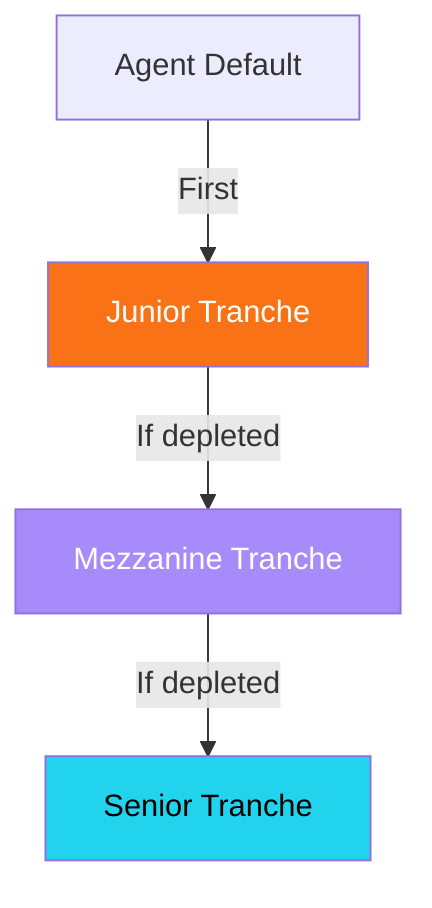

## Three-tranche architecture

The Krexa vault uses a **three-tranche system** to let LPs choose their risk/reward profile:

<CardGroup cols={3}>
  <Card title="Senior" icon="shield" color="#22d3ee">
    **10% APR** — Protected by both lower tranches. Lowest risk, lowest yield.
  </Card>
  <Card title="Mezzanine" icon="layers" color="#a78bfa">
    **12% APR** — Protected by Junior tranche. Medium risk and reward.
  </Card>
  <Card title="Junior" icon="flame" color="#f97316">
    **20% APR** — First-loss position. Highest risk, highest yield.
  </Card>
</CardGroup>

---

## Loss waterfall

When an agent defaults, losses are absorbed in order:

1. **Junior** absorbs losses first (up to total Junior deposits)
2. **Mezzanine** absorbs losses only if Junior is fully depleted
3. **Senior** absorbs losses only if both Junior and Mezzanine are depleted

<Tip>
  In practice, Senior tranche losses are extremely unlikely — they require total defaults exceeding the combined Junior + Mezzanine deposits.
</Tip>

---

## Yield generation

All three tranches earn yield from the same source: **interest payments from agent credit lines**.

| Source | Flow |
|--------|------|
| Agent interest payments | Credit Vault → LP Vault |
| Revenue Router debt service | Payment Router → Credit Vault → LP Vault |

Yield is distributed proportionally within each tranche based on deposit size.

---

## Choosing a tranche

| If you want... | Choose |
|----------------|--------|
| Capital preservation | **Senior** (10% APR) |
| Balanced risk/reward | **Mezzanine** (12% APR) |
| Maximum yield | **Junior** (20% APR) |

<Warning>
  All tranches carry risk. Deposited funds may be lost if agent defaults exceed the capacity of lower tranches. Only deposit what you can afford to lose.
</Warning>
